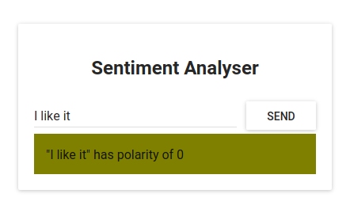
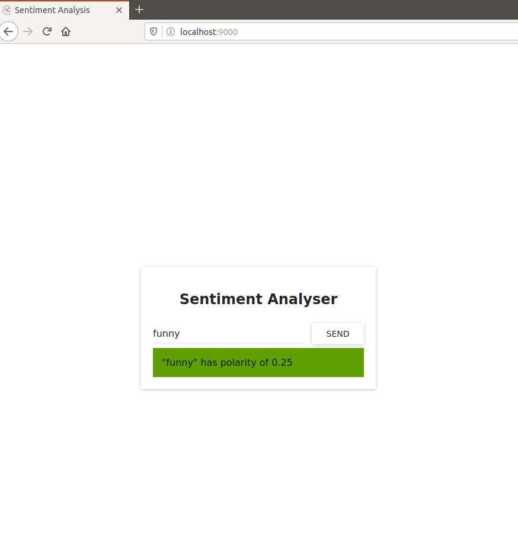
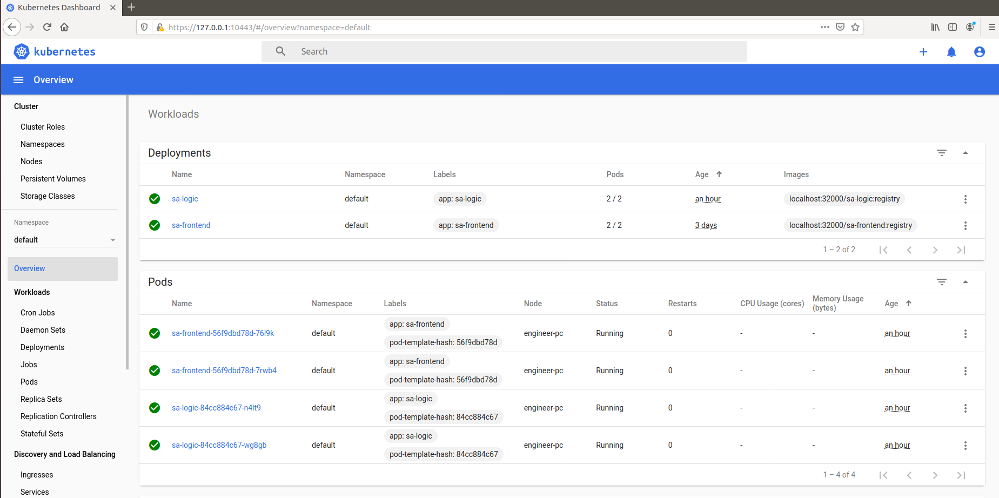

# Kubernetes learning - Part 1

## Origin

Original article can be found in [Learn Kubernetes in Under 3 Hours: A Detailed Guide to Orchestrating Containers](https://medium.freecodecamp.org/learn-kubernetes-in-under-3-hours-a-detailed-guide-to-orchestrating-containers-114ff420e882)

Original Repository can be found [here](https://github.com/rinormaloku/k8s-mastery)

## What's new

- Know how to setup locally using microk8s (part 1)
- Add kubernetes config at each repo (instead of gathering them) (part 1)
- Try DNS instead of fixed ip (part 2)
- Try ConfigMap (part 2)
- Try to deploy on AWS EKS (part 3)
- Try advance features like logging or monitoring (part 3)

## Summary Steps

* Application Demo: what we will build
* Services Detail: closer look at each service
* Bring kubernetes to your application

## Application Demo

The application takes one sentence as input, using Text Analysis, calculates the emotion of the sentence.


From the technical perspective, the application consists of three microservices. Each has one specific functionality:

* SA-Frontend: a Nginx web server that serves our ReactJS static files.
* SA-WebApp: a Java Web Application that handles requests from the frontend.
* SA-Logic: a python application that performs Sentiment Analysis.


This interaction is best illustrated by showing how the data flows between them:

1. A client application requests the index.html (which in turn requests bundled scripts of ReactJS application)
2. The user interacting with the application triggers requests to the Spring WebApp.
3. Spring WebApp forwards the requests for sentiment analysis to the Python app.
4. Python Application calculates the sentiment and returns the result as a response.
5. The Spring WebApp returns the response to the React app. (Which then represents the information to the user.)

## Services Detail

### Front-end

```
npm install
npm start
```

You should access it on localhost:3000 to take a look. Now make front-end production ready by:

```
npm run build
```

This generates a folder named build in your project tree, which contains all the static files needed for our ReactJS application.

Next, let's dockerize front-end.

```
docker build -f Dockerfile -t sa-frontend .
docker run -d -p 80:80 sa-frontend
```

You should be able to access the react application at `locahost:80`

### Logic

```
docker build -f Dockerfile -t sa-logic .
docker run -d -p 5050:5000 sa-logic
```

### Webapp

```
bash build.bash
docker build -f Dockerfile -t sa-webapp .
docker run -d -p 8080:8080  -e SA_LOGIC_API_URL='http://<container_ip or docker machine ip>:5000' sa-webapp
```

<container_ip or docker machine ip> can be found by using

```docker inspect <sa-logic-container-id>```

Now you get your microservices running:


Try some sentences *I like it* to check if it works



If there are any issues, use `docker container logs` to check service.


## Bring kubernetes to your application

Check out this [post]() to have an overview of kubernetes architecture

Our application in kubernetes could be organized like this:


Deployment steps we will proceed include:

* Install tools
* Set up registry
* Create and start a kubernetes cluster
* Verify cluster
* Deploy kubernetes dashboard
* Access dashboard
* Deploy service to cluster
* Setup logging
* View logs
* ....

### Install tools

Since we will use EKS to deploy Kubernetes so you should have one with administration access. You also need fork the repo so you can have Github access token to setup CI/CD later. This part only focuses on deploy locally so having an ubuntu OS is enough !

* Install [docker](https://docs.docker.com/install/linux/docker-ce/ubuntu/) and [docker-compose](https://docs.docker.com/compose/install/)(optional)
* Install [kubectl](https://kubernetes.io/docs/tasks/tools/install-kubectl/)
* Install [microk8s](https://microk8s.io/#get-started) (a minikube alternative)

Verify your cluster

```
engineer@engineer-PC:~$ microk8s.kubectl get nodes
NAME          STATUS   ROLES    AGE   VERSION
engineer-pc   Ready    <none>   41h   v1.17.2
engineer@engineer-PC:~$ microk8s.kubectl get pods
No resources found in default namespace.
engineer@engineer-PC:~$ microk8s.kubectl get services
NAME         TYPE        CLUSTER-IP     EXTERNAL-IP   PORT(S)   AGE
kubernetes   ClusterIP   xx.xx.xx.xx    <none>        443/TCP   41h
```

### Setup registry


**Question**: How Kubernetes know where to pull image ?

Images are stored in **registry** and that is location where Kubernetes will look up for images. We can have **local** registry or **remote regitry**. For now we will use local registry to avoid the time spent in uploading/downloading Docker images to/from remote registry.

However, local registry where image created by docker is only know to Docker itself. Kubernetes is not aware of the newly built images properly (We have to configure Kubernetes)

Fortunately, MicroK8s comes with **built-in registry**. This local registry is hosted within the Kubernetes cluster and is exposed as a NodePort service on port 32000 of the localhost. Note that this is an insecure registry and you may need to take extra steps to limit access to it.

* First step is enale this registry
```
$ microk8s.enable registry
Enabling the private registry
Enabling default storage class
[sudo] password for user: 
deployment.apps/hostpath-provisioner unchanged
storageclass.storage.k8s.io/microk8s-hostpath unchanged
serviceaccount/microk8s-hostpath unchanged
clusterrole.rbac.authorization.k8s.io/microk8s-hostpath unchanged
clusterrolebinding.rbac.authorization.k8s.io/microk8s-hostpath unchanged
Storage will be available soon
Applying registry manifest
namespace/container-registry unchanged
persistentvolumeclaim/registry-claim unchanged
deployment.apps/registry unchanged
service/registry unchanged
The registry is enabled
```

The add-on registry is backed up by a 20Gi persistent volume is claimed for storing images. To satisfy this claim the storage add-on is also enabled along with the registry.

The containerd daemon used by MicroK8s is configured to trust this insecure registry. To upload images we have to tag them with localhost:32000/your-image before pushing them.

We can either add proper tagging during build:

```docker build . -t localhost:32000/mynginx:registry```

Or tag an already existing image using the image ID.

```docker tag <image-ID> localhost:32000/mynginx:registry```

Now that the image is tagged correctly, it can be pushed to the registry:

```docker push localhost:32000/mynginx```

Pushing to this insecure registry may fail in some versions of Docker unless the daemon is explicitly configured to trust this registry. See [Configure docker service to use insecure registry
](https://github.com/Juniper/contrail-docker/wiki/Configure-docker-service-to-use-insecure-registry) for more detail.
To address this on Ubuntu we need to edit ```/etc/default/docker``` and update:

```DOCKER_OPTS="--insecure-registry localhost:32000"```

The new configuration should be loaded with a Docker daemon restart:

```sudo systemctl restart docker```

Now, we're ready to push our image to built-in registry

```
cd sa-frontend
docker build -f Dockerfile -t localhost:32000/sa-frontend:registry .
docker push localhost:32000/sa-frontend
cd sa-webapp
docker build -f Dockerfile -t localhost:32000/sa-webapp:registry .
docker push localhost:32000/sa-webapp
cd sa-logic
docker build -f Dockerfile -t localhost:32000/sa-logic:registry .
docker push localhost:32000/sa-logic
```

Output should be like this:

* Frontend

```
$ docker build -f Dockerfile -t localhost:32000/sa-frontend:registry .

Sending build context to Docker daemon  2.042MB
Step 1/2 : FROM nginx
latest: Pulling from library/nginx
68ced04f60ab: Pull complete 
c4039fd85dcc: Pull complete 
c16ce02d3d61: Pull complete 
Digest: sha256:380eb808e2a3b0dd954f92c1cae2f845e6558a15037efefcabc5b4e03d666d03
Status: Downloaded newer image for nginx:latest
 ---> a1523e859360
Step 2/2 : COPY build /usr/share/nginx/html
 ---> 341bf2ddc037
Successfully built 341bf2ddc037
Successfully tagged localhost:32000/sa-frontend:registry

$ docker push localhost:32000/sa-frontend
The push refers to repository [localhost:32000/sa-frontend]
468cb719ccf5: Pushed 
318be7aea8fc: Pushed 
fe08d5d042ab: Pushed 
f2cb0ecef392: Pushed 
registry: digest: sha256:15bc648b344162cf07f1d4ff8767dc2e5e81ab083e8d1d5fe4520119133b61ca size: 1158
```

* SA Logic

```
$ docker build -f Dockerfile -t localhost:32000/sa-logic:registry .

Sending build context to Docker daemon  9.216kB
Step 1/7 : FROM python:3.6.6-alpine
...
Successfully built 1b666de07738
Successfully tagged localhost:32000/sa-logic:registry

$ docker push localhost:32000/sa-logic
The push refers to repository [localhost:32000/sa-logic]
...
```

* SA Webapp

```
$ docker build -f Dockerfile -t localhost:32000/sa-webapp:registry .

Sending build context to Docker daemon  20.52MB
Step 1/5 : FROM openjdk:8-jdk-alpine
 ...
Successfully built db8d2d0b6f43
Successfully tagged localhost:32000/sa-webapp:registry

$ docker push localhost:32000/sa-webapp
The push refers to repository [localhost:32000/sa-webapp]
...
```

### Deploy a Pod

Usually, we wrap one container inside a pod, there will be other cases that we have more container in one pod. For example, we have another container handling heavy jobs in background. So web server container and this worker container should be placed inside a pod so that they can share volumes, or they communicate with each other using inter-process communicatio, ... We also note that one Kubernetes node can contains multi pods. Each pod has a unique IP address in the Kubernetes cluster

Now let's take a look at frontend pod:

```yaml
$ cat sa-frontend/kubernetes/sa-frontend-pod.yaml 
apiVersion: v1
kind: Pod                                          # 1
metadata:
  name: sa-frontend
labels:
  app: sa-frontend                                 # 2
spec:                                              # 3
  containers:
    - image: localhost:32000/sa-frontend:registry  # 4
      name: sa-frontend                            # 5
      ports:
        - containerPort: 80                        # 6
```

* **Kind**: specifies the kind of the Kubernetes Resource that we want to create. In our case, a Pod.
* **Name**: defines the name for the resource. We named it sa-frontend.
* **Label** apply label to this resource so that service can select it
* **Spec** is the object that defines the desired state for the resource. The most important property of a Pods Spec is the Array of containers.
* **Image** is the container image we want to start in this pod.
* **Name** is the unique name for a container in a pod.
* **Container** Port:is the port at which the container is listening. This is just an indicator for the reader (dropping the port doesn’t restrict access).

Now, try to create frontend pod

```
$ microk8s.kubectl create -f sa-frontend/kubernetes/sa-frontend-pod.yaml
pod "sa-frontend" created

$ microk8s.kubectl get pods
NAME          READY   STATUS             RESTARTS   AGE
sa-frontend   0/1     ContainerCreating   0          13s

# take a break

$ microk8s.kubectl get pods
NAME          READY   STATUS             RESTARTS   AGE
sa-frontend   0/1     Running   0          13s
```

**NOTE**: Accessing the application externally

To access the application externally we create a Kubernetes resource of type Service, that will be our next article, which is the proper implementation, but for quick debugging we have another option, and that is port-forwarding:

```
$ microk8s.kubectl port-forward sa-frontend 88:80
Forwarding from 127.0.0.1:88 -> 80
```

Open your browser in 127.0.0.1:88 and you will get to the react application.
Sudo might be need since we use port lower than 1024

### Deploy a service

Why do we need a service type in kubernetes ?

The Kubernetes Service resource acts as the entry point to a set of pods that provide the same functional service. This resource does the heavy lifting, of discovering services and load balancing between them as shown below (Assume we have 2 pod with the same functionality)


The method is that We **label** pod then apply **selector** to service then it knows which pods are its target. Refer to [here]() to check out **label**

This is service configuration:

```yaml
apiVersion: v1
kind: Service              # 1
metadata:
  name: sa-frontend-lb
spec:
  type: LoadBalancer       # 2
  ports:
  - port: 80               # 3
    protocol: TCP          # 4
    targetPort: 80         # 5
  selector:                # 6
    app: sa-frontend       # 7
```

* **Kind**: A service.
* **Type**: Specification type, we choose LoadBalancer because we want to balance the load between the pods.
* **Port**: Specifies the port in which the service gets requests.
* **Protocol**: Defines the communication.
* **TargetPort**: The port at which incomming requests are forwarded.
* **Selector**: Object that contains properties for selecting pods.
app: sa-frontend Defines which pods to target, only pods that are labeled with “app: sa-frontend”

To create the service execute the following command:

```
$ microk8s.kubectl create -f sa-frontend/kubernetes/service-sa-frontend-lb.yaml
service/sa-frontend-lb created

$ microk8s.kubectl get svc
NAME             TYPE           CLUSTER-IP       EXTERNAL-IP   PORT(S)        AGE
sa-frontend-lb   LoadBalancer   10.152.183.213   <pending>     80:32171/TCP   10s
```
The External-IP is in pending state (and don’t wait, as it’s not going to change). This is only because we are using Minikube. If we would have executed this in a cloud provider like Azure or GCP, we would get a Public IP, which makes our services worldwide accessible.

### Deployments

The Deployment resource automates the process of moving from one version of the application to the next, with zero downtime and in case of failures, it enables us to quickly roll back to the previous version.

Before we continue let’s state what we want to achieve, as it will provide us with the overview that enables us to understand the manifest definition for the deployment resource. What we want is:

* Two pods of the image sa-frontend
* Zero Downtime deployments,
* Pods labeled with app: sa-frontend so that the services get discovered by the Service sa-frontend-lb.

Now, we will translate the requirements into a Deployment definition.

#### Deployment Definition

Take a look at sa-frontend-deployment.yaml

```yaml
apiVersion: apps/v1
kind: Deployment                                          # 1
metadata:
  name: sa-frontend
  labels:
    app: sa-frontend
spec:
  selector:
    matchLabels:
      app: sa-frontend
  replicas: 2                                             # 2
  minReadySeconds: 15
  strategy:
    type: RollingUpdate                                   # 3
    rollingUpdate: 
      maxUnavailable: 1                                   # 4
      maxSurge: 1                                         # 5
  template:
    metadata:
      labels:
        app: sa-frontend                                  # 6
    spec:
      containers:
        - image: localhost:32000/sa-frontend:registry
          imagePullPolicy: Always                         # 7
          name: sa-frontend
          ports:
            - containerPort: 80
```

* **Kind**: A deployment.
* **Selector**: Pods matching the selector will be taken under the management of this deployment.
* **Replicas** is a property of the deployments Spec object that defines how many pods we want to run. So only 2.
* **Type** specifies the strategy used in this deployment when moving from the current version to the next. The strategy RollingUpdate ensures Zero Downtime deployments.
* **MaxUnavailable** is a property of the RollingUpdate object that specifies the maximum unavailable pods allowed (compared to the desired state) when doing a rolling update. For our deployment which has 2 replicas this means that after terminating one Pod, we would still have one pod running, this way keeping our application accessible.
* **MaxSurge** is another property of the RollingUpdate object that defines the maximum amount of pods added to a deployment (compared to the desired state). For our deployment, this means that when moving to a new version we can add one pod, which adds up to 3 pods at the same time.
* **Template**: specifies the pod template that the Deployment will use to create new pods. Most likely the resemblance with Pods struck you immediately.
* **app**: sa-frontend the label to use for the pods created by this template.
* **ImagePullPolicy** when set to Always, it will pull the container images on each redeployment.

Run command

```$ microk8s.kubectl apply -f sa-frontend/kubernetes/sa-frontend-deployment.yaml```

You'd see output

```deployment.apps/sa-frontend created```

Verify running pods

```
$ microk8s.kubectl get pods
NAME                           READY   STATUS    RESTARTS   AGE
sa-frontend-69c7d67dbf-hwm74   1/1     Running   0          88m
sa-frontend-69c7d67dbf-rt8hz   1/1     Running   0          88m
```

* Zero-Downtime deployment


Assume we have new requirement, The developers shipped their code and provided us with the only thing we need, the container image sa-frontend-green. We the DevOps have to roll a Zero-Downtime deployment

Edit the file *sa-frontend-deployment.yaml* by changing the container image to refer to the new image: *sa-frontend-green*. Save the changes as sa-frontend-deployment-green.yaml and execute the following command:

```
$ microk8s.kubectl apply -f sa-frontend-deployment-green.yaml --record
deployment "sa-frontend" configured
```

We can check the status of the rollout using the following command:

```
kubectl rollout status deployment sa-frontend
Waiting for rollout to finish: 1 old replicas are pending termination...
Waiting for rollout to finish: 1 old replicas are pending termination...
Waiting for rollout to finish: 1 old replicas are pending termination...
Waiting for rollout to finish: 1 old replicas are pending termination...
Waiting for rollout to finish: 1 old replicas are pending termination...
Waiting for rollout to finish: 1 of 2 updated replicas are available...
deployment "sa-frontend" successfully rolled out
```

According to the output the deployment was rolled out. It was done in such a fashion that the replicas were replaced one by one. Meaning that our application was always on

* Rolling back to a previous state

The new application has a critical bug, in PRODUCTION!! Revert back to the previous version immediately.

```
$ microk8s.kubectl rollout history deployment sa-frontend

deployment.apps/sa-frontend 
REVISION  CHANGE-CAUSE
1         <none>
2         kubectl apply --kubeconfig=/var/snap/microk8s/1173/credentials/client.config --filename=sa-frontend/kubernetes/sa-frontend-deployment-green.yaml --record=true
```

```
$ microk8s.kubectl rollout undo deployment sa-frontend --to-revision=1
deployment.apps/sa-frontend rolled back
```

Let's deploy other services:

* Deploy sa-logic pods

```
microk8s.kubectl apply -f sa-logic/kubernetes/sa-logic-deployment.yaml
```

* Deploy sa-logic service

we need a Service that “acts as the entry point to a set of pods that provide the same functional service”. This means that we can use the Service SA-Logic as the entry point to all the SA-Logic pods.

```
microk8s.kubectl apply -f sa-logic/kubernetes/service-sa-logic.yaml
```

* Deploy sa-webapp pods

```
microk8s.kubectl apply -f sa-webapp/kubernetes/sa-web-app-deployment.yaml
```

* Deploy sa-webapp service

```
microk8s.kubectl apply -f sa-webapp/kubernetes/service-sa-web-app-lb.yaml
```

#### Verify running services and pods

```
$ microk8s.kubectl get svc
NAME             TYPE           CLUSTER-IP       EXTERNAL-IP   PORT(S)        AGE
kubernetes       ClusterIP      10.152.183.1     <none>        443/TCP        5d20h
sa-frontend-lb   LoadBalancer   10.152.183.213   <pending>     80:32171/TCP   3d21h
sa-logic         ClusterIP      10.152.183.216   <none>        80/TCP         7m2s
sa-web-app-lb    LoadBalancer   10.152.183.234   <pending>     80:31924/TCP   6s
```

```
$ microk8s.kubectl get pod
NAME                           READY   STATUS    RESTARTS   AGE
sa-frontend-56f9dbd78d-76l9k   1/1     Running   0          3h36m
sa-frontend-56f9dbd78d-7rwb4   1/1     Running   0          3h36m
sa-logic-84cc884c67-n4lt9      1/1     Running   0          3h38m
sa-logic-84cc884c67-wg8gb      1/1     Running   0          3h38m
sa-web-app-69bbb67c75-ngfmw    1/1     Running   0          2m3s
sa-web-app-69bbb67c75-tkfc2    1/1     Running   0          2m3s
```


At this time, you know how to deploy other services: sa-webapp and sa-logic but how services call each other ? We need answer why environment variable **SA_LOGIC_API_URL** can be resolved and **How sa-frontend call sa-webapp**

*  Service IP address

Kubernetes has a special pod the kube-dns. And by default, all Pods use it as the DNS Server. One important property of kube-dns is that it creates a DNS record for each created service.

This means that when we created the service sa-logic it got an IP address. Its name was added as a record (in conjunction with the IP) in kube-dns. This enables all the pods to translate the sa-logic to the SA-Logic services IP address.

* Get the SA-WebApp Loadbalancer IP

```
$ microk8s.kubectl get service
NAME            TYPE           CLUSTER-IP       EXTERNAL-IP   PORT(S)        AGE
sa-web-app-lb   LoadBalancer   10.152.183.234   <pending>     80:31924/TCP   15m
```

* Edit file **App.js**

```javascript
const wepAppURL = 'http://10.152.183.234:80/sentiment'

class App extends Component {
    ...

    analyzeSentence() {
        fetch(wepAppURL, {
            method: 'POST',
            headers: {
                'Content-Type': 'application/json'
            },
            body: JSON.stringify({sentence: this.textField.getValue()})
        })
            .then(response => response.json())
            .then(data => this.setState(data));
    }
  ...
```

* Rebuild image and push to registry

```
$ npm run build
$ docker build -f Dockerfile -t localhost:32000/sa-frontend-2:registry .

$ docker push localhost:32000/sa-frontend-2
```

* Edit deployment definition then Apply

```yaml
containers:
  - image: localhost:32000/sa-frontend-2:registry
```


```
$ microk8s.kubectl apply -f sa-frontend/kubernetes/sa-frontend-deployment.yaml 
```

* Again, use port forward to access sa-frontend

```
sudo microk8s.kubectl port-forward sa-frontend-75b6f4bb4b-5l42x 9000:80
```

Now you can test application:




### Bonus: Dashboard

The standard Kubernetes Dashboard is a convenient way to keep track of the activity and resource use of MicroK8s

```microk8s.enable dashboard```

To log in to the Dashboard, you will need the access token (unless RBAC has also been enabled). This is generated randomly on deployment, so a few commands are needed to retrieve it:

```
token=$(microk8s.kubectl -n kube-system get secret | grep default-token | cut -d " " -f1)
microk8s.kubectl -n kube-system describe secret $token
```

Next, you need to connect to the dashboard service. While the MicroK8s snap will have an IP address on your local network (the Cluster IP of the kubernetes-dashboard service), you can also reach the dashboard by forwarding its port to a free one on your host with:

```
microk8s.kubectl port-forward -n kube-system service/kubernetes-dashboard 10443:443
```

You can then access the Dashboard at https://127.0.0.1:10443

And voila:



Set this option to --address 0.0.0.0 to make the Dashboard public. For example:

```
microk8s.kubectl port-forward -n kube-system service/kubernetes-dashboard 10443:443 --address 0.0.0.0
```

See you in [part 2](./posts/PART2.md)